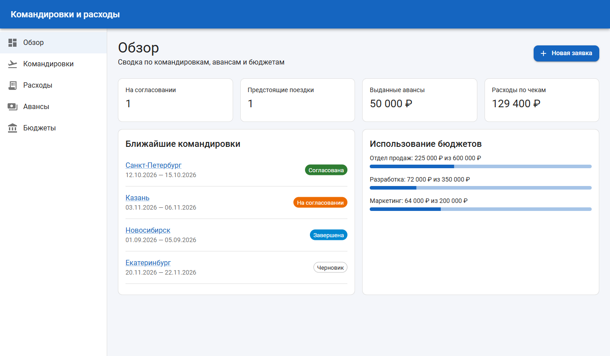

# Портал командировок и расходов

Учебный full-stack проект по курсу «Fullstack» (1 семестр). Приложение помогает сотрудникам оформлять командировки, запрашивать авансы и сдавать отчёты о расходах, а руководителям и бухгалтерии контролировать бюджеты. Отдельный сценарий: загрузка фото чека и предзаполнение формы расхода суммой и датой.

Статус: выполнены **лабораторная №1** (интерфейс и каркас frontend, тег `lab-1`) и **лабораторная №2** (backend, API и БД, тег `lab-2`). Frontend пока работает на демонстрационных данных и с API не связан. Это тема лабораторной №5.

Структура репозитория: `frontend/` (React), `backend/` (FastAPI), `docs/screenshots/`, `docker-compose.yml` (PostgreSQL).

## Пользовательские сценарии

1. Сотрудник оформляет заявку на командировку (направление, цель, даты, плановая сумма, бюджет).
2. Сотрудник запрашивает аванс под командировку и видит его статус.
3. Сотрудник добавляет расход по командировке. Он загружает фото чека, и сумма с датой подставляются автоматически, после чего их нужно проверить.
4. Руководитель просматривает заявки и фильтрует их по статусу.
5. Руководитель или бухгалтер контролирует расход бюджетов отделов.

## Экраны

| Экран | Маршрут | Назначение |
|---|---|---|
| Обзор | `/` | Сводные показатели, ближайшие поездки, использование бюджетов |
| Командировки | `/trips` | Список заявок с фильтром по статусу |
| Карточка командировки | `/trips/:id` | Сводка, авансы и расходы по поездке |
| Новая заявка | `/trips/new` | Форма заявки |
| Расходы | `/expenses` | Список расходов с признаком наличия чека |
| Новый расход | `/expenses/new` | Форма с загрузкой чека и предзаполнением |
| Авансы | `/advances` | Запросы и выдача авансов |
| Бюджеты | `/budgets` | Лимит, резерв и остаток по отделам |
| 404 | `*` | Несуществующая страница |

Скриншоты для desktop (1366 px) и mobile (390 px) лежат в [docs/screenshots](docs/screenshots). Например: 

## Стек

- Frontend: React 19, TypeScript, Vite, React Router, **MUI (Material UI)**.
- Backend: Python, FastAPI, PostgreSQL, SQLAlchemy (лабораторная №2).

**Почему MUI.** В нём есть готовые таблицы, формы, навигационный drawer и система тем, поэтому оформление получается единым без ручной вёрстки. Адаптивность обеспечивают breakpoints и Grid. Библиотека хорошо типизирована под TypeScript и популярна, так что документации много.

## Запуск frontend

Нужен Node.js 20+.

```bash
cd frontend
npm install
npm run dev        # http://localhost:5173
```

Проверки: `npm run build` (включает `tsc -b`), `npm run lint`.

Скриншоты (при запущенном `npm run dev` и установленном Chrome):

```bash
BASE_URL=http://127.0.0.1:5173 node scripts/screenshots.mjs
# при нестандартном пути к браузеру: CHROME_PATH=<путь к chrome>
```

## Структура frontend

```
frontend/src
├── components/   Layout (шапка + адаптивное меню), PageHeader, StatusChip
├── pages/        по одному файлу на экран
├── data/         демонстрационные данные (mock.ts) и подписи статусов (labels.ts)
├── types/        TypeScript-интерфейсы сущностей
└── theme/        тема MUI
```

## Ограничения лабораторной №1

- Данные демонстрационные (`src/data/mock.ts`), с backend интеграции пока нет.
- Формы только сверстаны: сохранения и валидации нет.
- Распознавание чека **имитируется**: после выбора файла подставляются фиксированные значения. Реального OCR нет.
